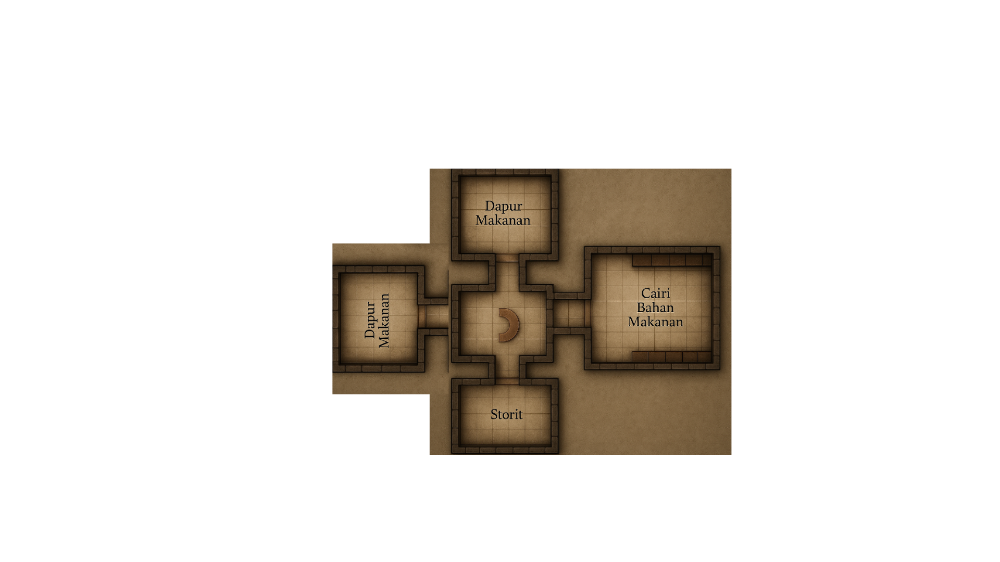

# 🔫 DOOM GTI — Raycasting FPS Game

> **Tugas Besar Game Technology and Innovation — Semester 4**  
> Universitas Diponegoro · Dibangun dengan **C++ / OpenGL / FreeGLUT**


---

## 📖 Deskripsi

Game **First-Person Shooter (FPS)** bergaya retro terinspirasi dari DOOM Classic (1993), dibangun dari nol menggunakan teknik **Raycasting** untuk merender dunia 3D dari peta 2D berbasis grid.

Engine raycasting menggunakan algoritma **DDA (Digital Differential Analyzer)** untuk menembakkan sinar per-kolom piksel, menghasilkan ilusi perspektif 3D yang autentik. Sementara itu, objek dalam dunia (senjata, musuh, item) dirender menggunakan **OpenGL 3D primitives** dengan frustum kamera yang disesuaikan.

**Fitur unggulan:**
- ✅ Raycasting engine dengan anti-fisheye correction dan distance fog
- ✅ 3 jenis musuh dengan AI state machine (IDLE → CHASE → ATTACK → DYING → DEAD)
- ✅ Sistem senjata 3D (Pistol + Shotgun) dengan recoil, muzzle flash, dan reload
- ✅ Item pickup (Health, Ammo, Armor) dengan animasi float & rotate
- ✅ HUD lengkap: crosshair, health bar, minimap, kill counter, wave indicator

### ⚡ Optimasi Performa (Anti-Lag)
Game ini mengimplementasikan teknik rendering yang sangat dioptimasi agar tetap berjalan lancar (30-60 FPS) meskipun peta dunia berukuran besar:
1. **Batching Draw Calls (`GL_POINTS` & `GL_LINES`)**: Mengurangi drastis panggilan `glBegin`/`glEnd` ke OpenGL dengan menggabungkan ribuan perhitungan piksel lantai dan kolom tembok ke dalam satu instruksi besar.
2. **Adaptive Raycasting Step**: Algoritma lantai pintar (*floor raycasting*) yang mengurangi beban hitungan tekstur berdasar jarak. Sistem memproses setiap 1 piksel untuk jarak dekat, setiap 2 piksel untuk jarak menengah, dan setiap 4 piksel untuk jarak jauh.
3. **Occlusion & Fog Culling**: Sistem langsung melewati perhitungan untuk area lantai yang tertutup kabut tebal total (*fog*), menggantinya dengan blok warna solid secara instan.
4. **Compiler Optimization (`-O2`)**: Memanfaatkan pengaturan *compiler* C++ tingkat lanjut (Level 2) untuk merampingkan perhitungan matematika mentah dan menghemat siklus prosesor saat dieksekusi.

---

## 🗺️ Layout Peta



Peta berukuran **40×32** grid dengan beberapa zona berbeda: ruangan dalam bangunan, koridor penghubung, dan area terbuka untuk pertempuran.

---

## 🎮 Kontrol

| Input | Aksi |
|-------|------|
| `W` / `S` | Maju / Mundur |
| `A` / `D` | Strafe Kiri / Kanan |
| **Mouse (Horizontal)** | Putar kamera kiri/kanan |
| **Mouse (Vertical)** | Atur pitch (lihat atas/bawah) |
| **LMB** / `Space` | Tembak |
| `R` | Reload senjata |
| `1` | Switch ke Pistol |
| `2` | Switch ke Shotgun |
| **Scroll Mouse** | Ganti senjata |
| `F5` | Respawn / Restart level |
| `ESC` | Keluar |

---

## 🚀 Cara Build & Jalankan

### ✅ Menggunakan Dev-C++ GTI MOD (Direkomendasikan)

1. Buka **Dev-C++ GTI MOD**
2. **File → Open Project** → pilih file `tubesGame.dev`
3. Tekan **F9** untuk Compile & Run langsung

### ⚡ Menggunakan Terminal (PowerShell / VS Code)

> Sangat direkomendasikan jika sering mengedit file kode tanpa membuka Dev-C++ terus menerus.

```powershell
# Force recompile (Hapus cache object & Build ulang)
Remove-Item -Force main.o -ErrorAction SilentlyContinue; mingw32-make -f Makefile.win

# Jalankan game
.\tubesGame.exe
```

### 🔧 Menggunakan Command Line (MinGW32)

> Pastikan MinGW32 (Dev-C++ GTI MOD) sudah terinstall.

```bash
# Step 1 — Compile
g++.exe -c main.cpp -o main.o ^
  -I"C:/Program Files (x86)/GibsTeam/Dev-C++ GTI MOD/Dev-Cpp/Dev-Cpp/MinGW32/include" ^
  -g3

# Step 2 — Link & Build EXE
g++.exe main.o -o tubesGame.exe ^
  -L"C:/Program Files (x86)/GibsTeam/Dev-C++ GTI MOD/Dev-Cpp/Dev-Cpp/MinGW32/lib" ^
  -static-libstdc++ -static-libgcc -mwindows ^
  -lglut32 -lglu32 -lopengl32 -lwinmm -lgdi32 -g3

# Step 3 — Jalankan
.\tubesGame.exe
```

---

## 📂 Struktur File

```
gameDOOM/
├── main.cpp          # Entry point, game loop, input handler (keyboard & mouse)
├── map.h             # Data level — grid 40×32, definisi tipe sel & warna dinding
├── player.h          # State player, movement WASD, collision, mouse look
├── raycaster.h       # Engine raycasting DDA — render dinding, lantai, langit-langit
├── texture.h         # Utilitas warna: clamp, lerp, distance fog
├── weapon.h          # Sistem senjata 3D, projectile, recoil, muzzle flash
├── enemy.h           # AI musuh 3D (Imp, Demon, Spectre) + state machine
├── item.h            # Item pickup 3D (Health, Ammo, Armor) + wave system
├── hud.h             # Overlay HUD: crosshair, health bar, minimap, score
├── Makefile.win      # Build configuration untuk Dev-C++ / MinGW32
├── layoutMap.png     # Visualisasi layout peta
├── README.md         # Dokumen ini
└── DOCS.md           # Dokumentasi teknis lengkap per-file
```

---

## 📈 Versi & Roadmap

| Versi | Status | Fitur Utama |
|-------|--------|-------------|
| **V1** | ✅ Selesai | Core engine, raycasting DDA, peta grid, movement WASD, mouse look, HUD dasar |
| **V2** | ✅ Selesai | Senjata 3D (Pistol + Shotgun), projectile, recoil, muzzle flash, reload, weapon bob |
| **V3** | ✅ Selesai | 3 tipe musuh 3D, AI state machine, hit detection, damage flash, kill counter, minimap dot |
| **V4** | ✅ Selesai | Item drop (Health/Ammo/Armor), pickup otomatis, animasi float+rotate, score, wave system |
| **V5** | 🔲 Pending | Menu screen, sound (WinMM), multiple levels, door interaktif, highscore leaderboard |

---

## 🛠️ Teknologi

| Komponen | Detail |
|----------|--------|
| Bahasa | C++ (C99/C++11) |
| Compiler | GCC 4.8.1 via MinGW32 |
| IDE | Dev-C++ GTI MOD |
| Windowing | FreeGLUT (`glut32`) |
| Rendering | OpenGL fixed-function pipeline |
| Math | `math.h` standar (sin, cos, atan2, sqrtf) |

---

## 📚 Referensi

- [Lode's Raycasting Tutorial](https://lodev.org/cgtutor/raycasting.html) — Dasar algoritma DDA raycasting
- [DOOM Classic (1993)](https://en.wikipedia.org/wiki/Doom_(1993_video_game)) — Referensi desain game
- [Call of Duty — Nuketown](https://callofduty.fandom.com/wiki/Nuketown) — Referensi desain peta

---

## 👥 Anggota Tim

| Nama | NIM | Branch |
|------|-----|--------|
| *(isi nama)* | *(isi NIM)* | `dev/orang1` |
| *(isi nama)* | *(isi NIM)* | `dev/orang2` |
| *(isi nama)* | *(isi NIM)* | `dev/orang3` |
| *(isi nama)* | *(isi NIM)* | `dev/orang4` |

---

## 🌿 Panduan Kolaborasi Git (4 Orang)

### Struktur Branch

```
main                  ← Branch utama (STABIL, selalu bisa dijalankan)
└── dev               ← Branch integrasi (semua fitur dikumpulkan di sini)
    ├── dev/orang1    ← Branch milik anggota 1
    ├── dev/orang2    ← Branch milik anggota 2
    ├── dev/orang3    ← Branch milik anggota 3
    └── dev/orang4    ← Branch milik anggota 4
```

> **Aturan Utama:**
> - ❌ **JANGAN push langsung ke `main`**
> - ✅ Kerjakan di branch sendiri, lalu merge ke `dev`, baru ke `main`

---

### 🔧 Setup Awal (Lakukan Sekali)

**Clone repo dan buat branch masing-masing:**

```bash
# Clone repo
git clone https://github.com/ZkaZF/gameDOOM.git
cd gameDOOM

# Buat branch dev (jika belum ada)
git checkout -b dev
git push origin dev

# Buat branch pribadi dari dev (ganti "orang1" sesuai nama/nim)
git checkout -b dev/orang1
git push origin dev/orang1
```

---

### 📅 Alur Kerja Harian

**Setiap kali mau mulai coding:**

```bash
# 1. Pastikan branch kamu aktif
git checkout dev/orang1

# 2. Ambil update terbaru dari dev (biar tidak ketinggalan)
git fetch origin
git merge origin/dev

# 3. Mulai koding...

# 4. Simpan perubahan
git add .
git commit -m "feat: tambah fitur XYZ"

# 5. Push ke branch sendiri
git push origin dev/orang1
```

---

### 🔀 Merge ke `dev` (Setelah Fitur Selesai)

```bash
# 1. Pindah ke branch dev
git checkout dev

# 2. Ambil update terbaru dari remote
git pull origin dev

# 3. Merge branch kamu ke dev
git merge dev/orang1

# 4. Jika ada konflik, selesaikan dulu lalu:
git add .
git commit -m "merge: gabung fitur orang1 ke dev"

# 5. Push ke remote
git push origin dev
```

---

### 🚀 Merge ke `main` (Setelah Semua Fitur Stabil)

> Lakukan ini bersama-sama saat milestone (V2, V3, dst.) sudah siap.

```bash
# 1. Pindah ke main
git checkout main

# 2. Merge dari dev
git merge dev

# 3. Push ke remote
git push origin main
```

---

### 💡 Tips Menghindari Konflik

| Tips | Penjelasan |
|------|------------|
| **Bagi file per orang** | Usahakan tiap orang punya file yang dikerjakan sendiri (misal: orang1 → `enemy.h`, orang2 → `item.h`) |
| **Commit sering & kecil** | Jangan numpuk perubahan besar, commit tiap fitur kecil selesai |
| **Pull sebelum mulai** | Selalu `git pull origin dev` sebelum mulai coding baru |
| **Pesan commit jelas** | Gunakan format: `feat:`, `fix:`, `docs:`, `refactor:` di depan pesan |
| **Komunikasi tim** | Kalau mau edit file yang sama, kabari anggota lain dulu |

---

### 📝 Contoh Pesan Commit yang Baik

```bash
git commit -m "feat: tambah AI state ATTACK untuk Demon enemy"
git commit -m "fix: perbaiki crash saat ammo habis dan tembak"
git commit -m "docs: update README tambah kontrol keyboard"
git commit -m "refactor: pisah renderItem jadi fungsi terpisah"
```